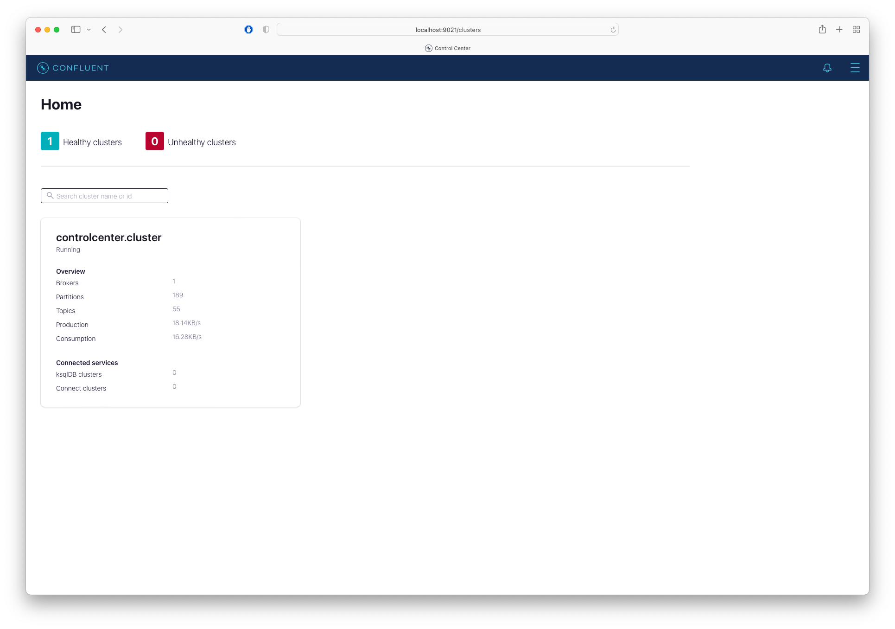
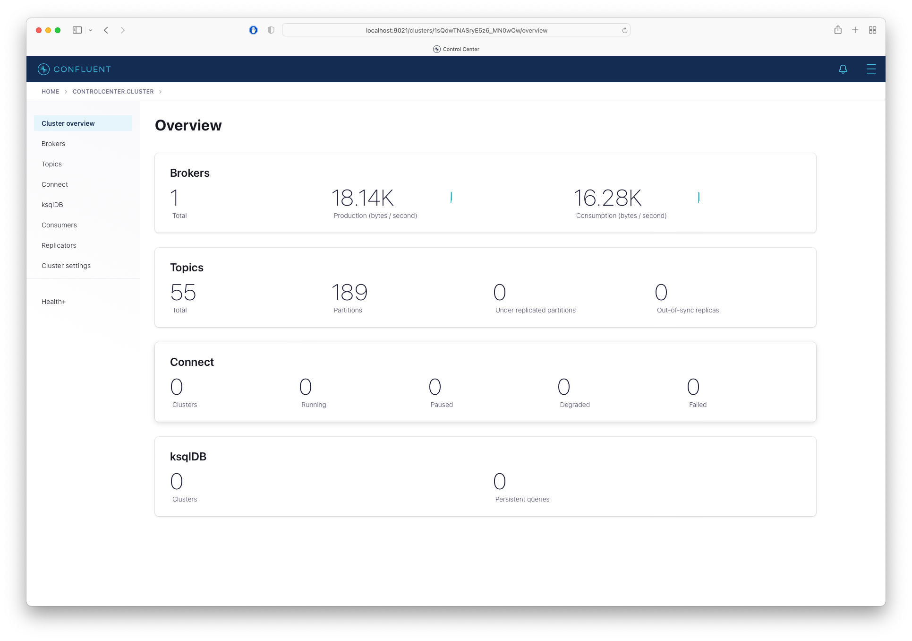

# Confluent

Confluent consists of

- Zookeeper
- Confluent Server
- Confluent Controlcenter
- Schema Registry

References: [Confluent Documentation](https://docs.confluent.io/platform/current/overview.html)

## Connections

- [Controlcenter - http://localhost:9021](http://localhost:9021)
- [Schema Registry - http://localhost:8081](http://localhost:8081)
- Broker: localhost:9092
- Zookeeper: localhost:2181

## Screenshots

