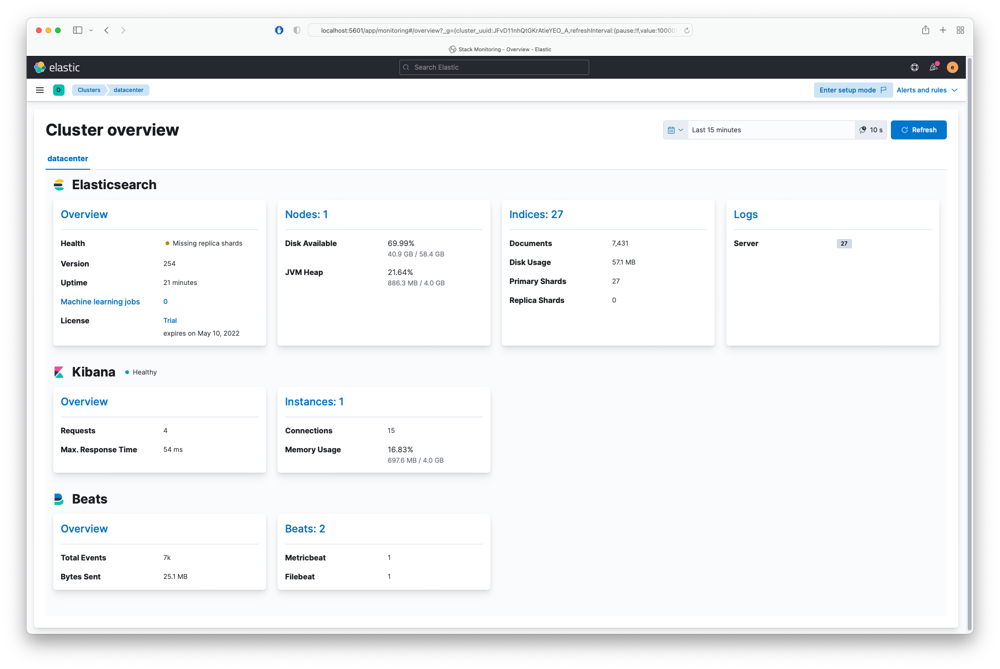
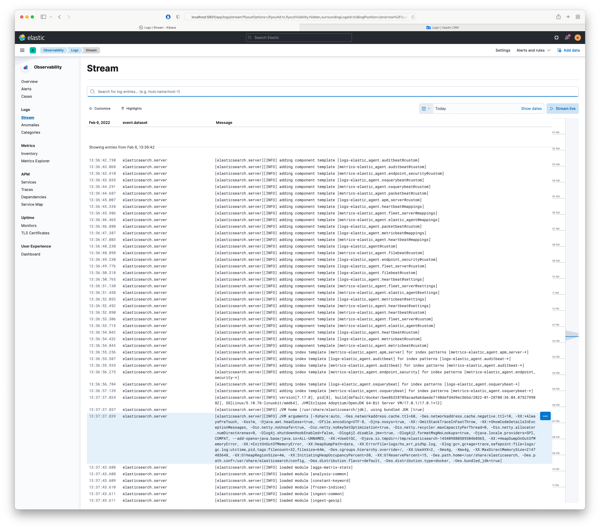
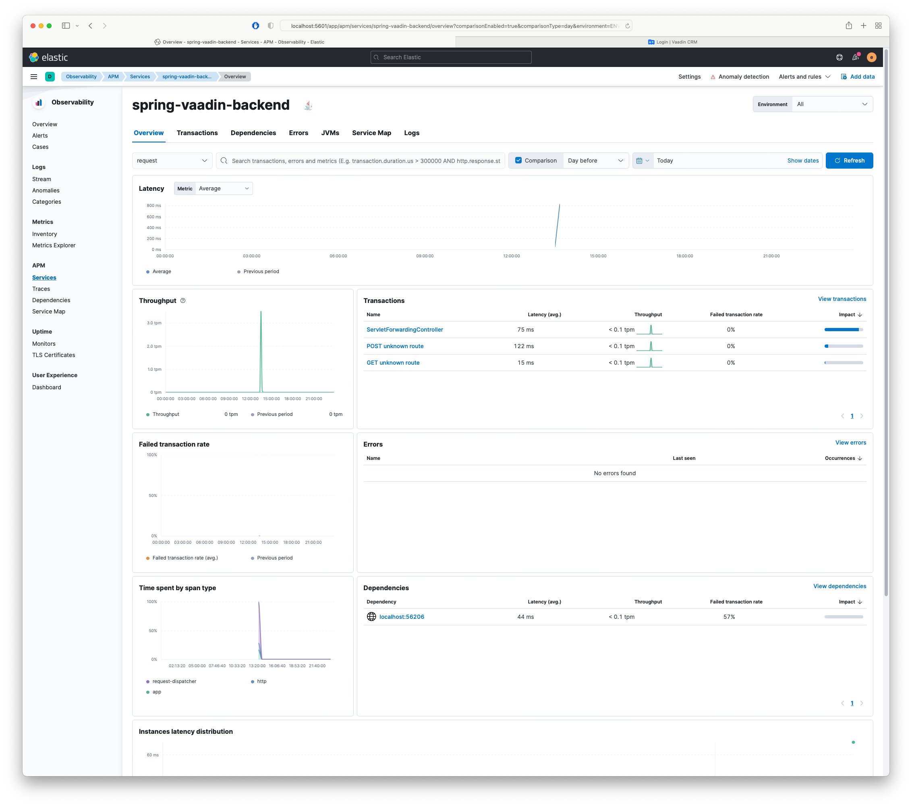

# Elastic Stack

`docker-compose -f docker-compose.elastic.yml up`

Elastic stack consists of

- Elasticsearch
- Metricbeat for Stack Monitoring
- Filebeat
- Kibana
- APM Server (:warning: not yet Elastic Agent)

References: [Elastic Stack Documentation](https://www.elastic.co/guide/index.html)

## Security

Set password for `elastic` superuser and encrypting kyes in `.env`.

Default password is `secret`.

## Connections

- [Kibana - http://localhost:5601](http://localhost:5601)
- [APM - http://localhost:8200](http://localhost:8200)
- [Elasticsearch - http://localhost:9200](http://localhost:9200)

## Logs

Want to pass your own logs?

Set `ELASTIC__LOG_FILES` in `.env` to your log file location (`*.log`) or adapt `elastic/filebeat.yml` to your needs.

## Screenshots

