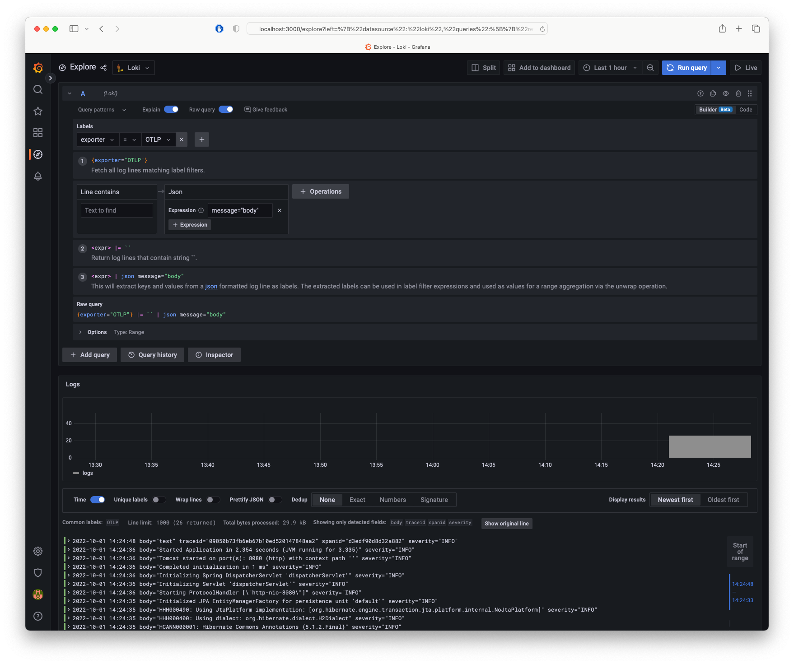
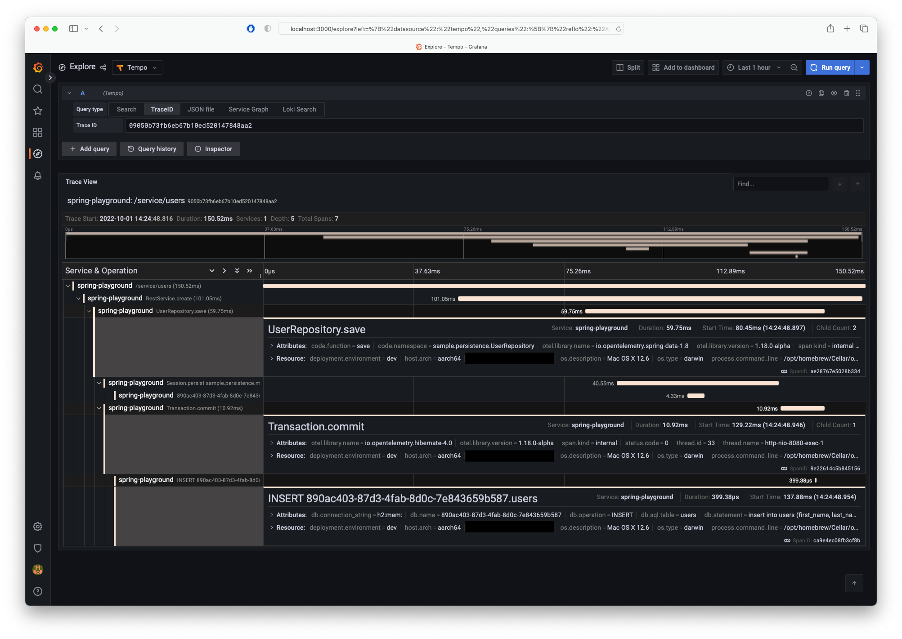
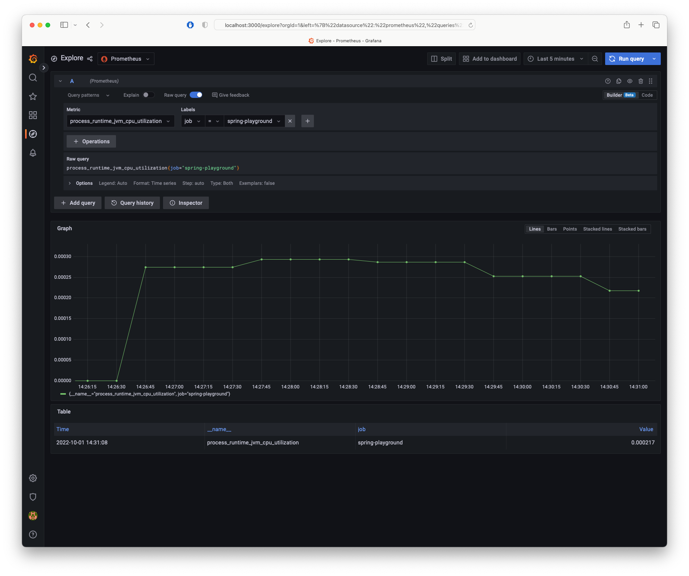

# Grafana Stack

Grafana stack consists of

- Grafana
- Loki
- Prometheus
- Temp
- Opentelemtry Collector Contrib

The idea is that you can connect an Opentelemtry Agent

```bash
OTEL_EXPORTER_OTLP_ENDPOINT=http://localhost:4317
OTEL_METRICS_EXPORTER=otlp
OTEL_LOGS_EXPORTER=otlp
OTEL_TRACES_EXPORTER=otlp
```

the Otel Collector then forwards

- Metrics to Prometheus
- Traces to Tempo
- Logs to Loki

## Security

Set password for `admin` user in `.env`.

Default password is `secret`.

## Connections

- [Grafana - http://localhost:3000](http://localhost:3000)
- OTLP gPRC Endpoint - http://localhost:4317


## Screenshots





